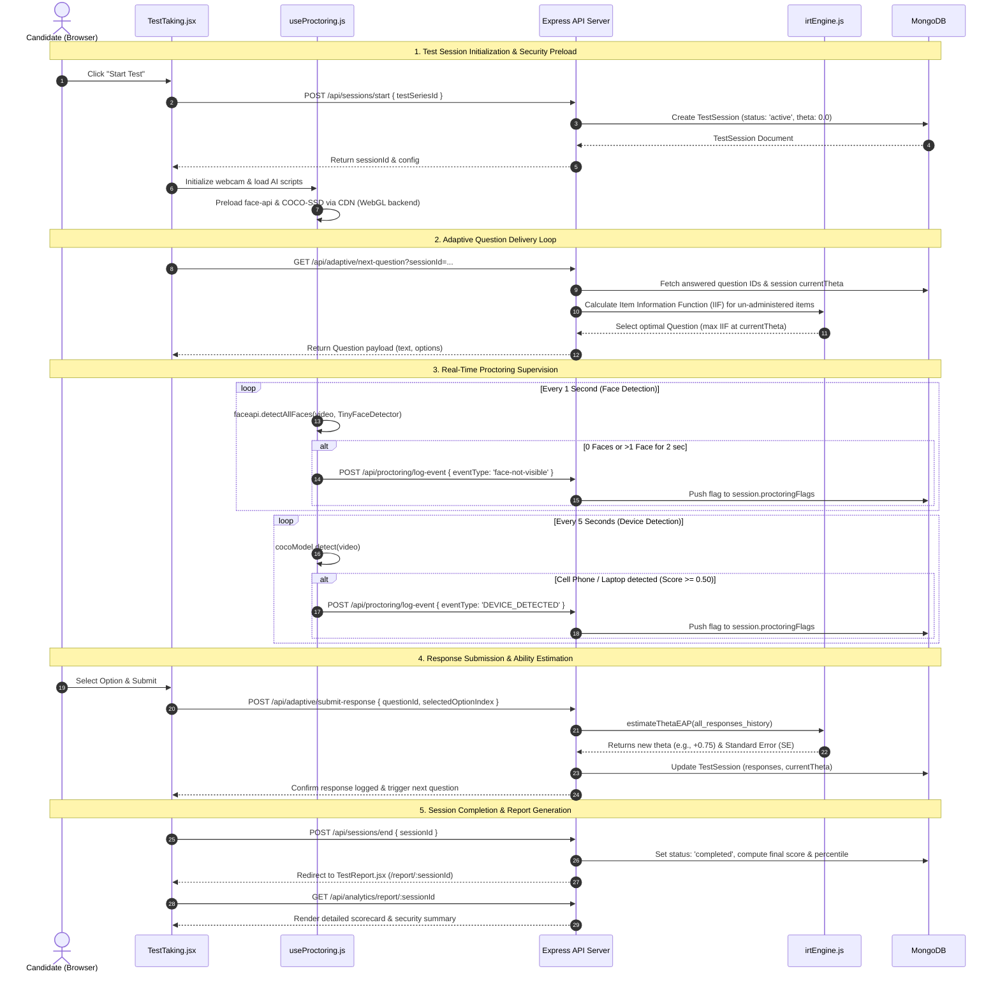

# 📘 Comprehensive Viva Guide & Full-Stack Architecture Manual

This document provides an exhaustive, Viva-ready technical guide for the **AI-Proctored Adaptive Test Platform**. It details every technology used, mathematical model, artificial intelligence pipeline, database schema, and exact file-by-file connections between the frontend and backend.

---

## 📑 Table of Contents
1. [Executive Summary & Core Platform Concept](#1-executive-summary--core-platform-concept)
2. [Complete Technology Stack Breakdown](#2-complete-technology-stack-breakdown)
   - [A. Artificial Intelligence & Computer Vision](#a-artificial-intelligence--computer-vision)
   - [B. Adaptive Testing & Psychometrics (IRT Engine)](#b-adaptive-testing--psychometrics-irt-engine)
   - [C. Frontend Stack & UI System](#c-frontend-stack--ui-system)
   - [D. Backend Stack & Security](#d-backend-stack--security)
   - [E. Database & Database Fallback Architecture](#e-database--database-fallback-architecture)
3. [File-by-File Connections (Frontend ↔ Backend Mapping)](#3-file-by-file-connections-frontend--backend-mapping)
   - [A. Client-Side Directory (`/client/src`)](#a-client-side-directory-clientsrc)
   - [B. Server-Side Directory (`/server`)](#b-server-side-directory-server)
4. [End-to-End System Workflows & Data Pipelines](#4-end-to-end-system-workflows--data-pipelines)
5. [Viva Examiner Q&A Cheat Sheet](#5-viva-examiner-qa-cheat-sheet)

---

## 1. Executive Summary & Core Platform Concept

The **AI-Proctored Adaptive Test Platform** is an enterprise-grade MERN stack web application built for automated, secure, and personalized examination delivery. It combines two advanced engines:
1. **AI-Powered Client-Side Computer Vision Proctoring**: Monitors candidates in real-time via webcam for integrity breaches (face invisibility, multi-face presence, cell phones, tablets, tab switching) without sending raw video streams to external servers, protecting candidate privacy.
2. **Item Response Theory (IRT) Adaptive Engine**: Dynamically calculates candidate ability ($\theta$) in real-time after every question response, selecting questions optimized for the candidate's precise difficulty tolerance.

---

## 2. Complete Technology Stack Breakdown

### A. Artificial Intelligence & Computer Vision

#### 1. `@vladmandic/face-api` (Face Detection & Facial Feature Analysis)
* **Model Used**: `TinyFaceDetector` (a lightweight Single-Shot Detector / SSD based on Mobilenet architecture tuned for mobile and web performance).
* **How it works**:
  * Loads pretrained model weights from local client assets `/models`.
  * Configured with `inputSize: 224` and `scoreThreshold: 0.35` in [useProctoring.js](file:///d:/AI%20proctor%20examination/client/src/hooks/useProctoring.js).
  * Executes every **1,000 ms (1 second)** over the HTML5 webcam video stream using GPU-accelerated **WebGL** (`tf.setBackend('webgl')`). If WebGL fails, it gracefully falls back to CPU execution.
* **Violations Monitored**:
  * **`face-not-visible`**: Triggered when 0 faces are detected for 2 consecutive cycles.
  * **`multiple-faces`**: Triggered when >1 faces are detected for 2 consecutive cycles.

#### 2. `@tensorflow-models/coco-ssd` + `@tensorflow/tfjs` (Object & Device Detection)
* **Model Used**: **COCO-SSD** with a **Lite MobileNet v2** neural network backbone.
* **How it works**:
  * Preloaded on proctoring session launch.
  * Executes every **5,000 ms (5 seconds)** over the webcam frame.
  * Filters detected bounding box classes against a strict restricted list: `['cell phone', 'laptop', 'book', 'tablet', 'camera']`.
  * If an object class score is $\ge 0.50$, it emits a **`DEVICE_DETECTED`** violation with bounding box metadata. Includes a **30-second throttle cache** per object class to avoid request flooding.

#### 3. Browser Focus & Fullscreen Security Controls
* **Page Visibility API (`document.hidden` / `visibilitychange`)**: Logs a **`tab-switch`** violation when the window loses visibility. Does not use standard `window.onblur` to avoid false positives triggered by OS or extension popups.
* **HTML5 Fullscreen API**: Enforces full-screen lock in [TestTaking.jsx](file:///d:/AI%20proctor%20examination/client/src/pages/TestTaking.jsx). Exiting full-screen pauses inputs and locks the screen.

---

### B. Adaptive Testing & Psychometrics (IRT Engine)

Located in [irtEngine.js](file:///d:/AI%20proctor%20examination/server/services/irtEngine.js).

#### 1. Three-Parameter Logistic (3PL) Model
Calculates the probability $P(\theta)$ of candidate answering a item correctly:
$$P(\theta) = c + \frac{1 - c}{1 + e^{-D \cdot a \cdot (\theta - b)}}$$
* $\theta$: Candidate estimated ability (range: $-4.0$ to $+4.0$).
* $b$: Question difficulty parameter.
* $a$: Question discrimination parameter.
* $c$: Pseudo-guessing parameter ($0.25$ for 4-option questions).
* $D = 1.702$: Normal metric scaling constant.

#### 2. Expected A Posteriori (EAP) Ability Estimation
* Integrates over **161 quadrature points** from $-4.0$ to $+4.0$ (step size $0.05$).
* Uses a Standard Normal Prior distribution $N(0,1)$.
* Employs log-likelihood shift normalization ($\max W$) to prevent numeric floating-point underflow in JavaScript.
* Returns updated ability estimate $\theta$ and Standard Error ($SE$).

#### 3. Item Information Function (IIF) Item Selection
Calculates information value $I(\theta)$:
$$I(\theta) = a^2 \frac{(P(\theta) - c)^2}{(1 - c)^2} \frac{1 - P(\theta)}{P(\theta)}$$
Selects the next un-administered question in the question bank that maximizes $I(\theta)$ at the candidate's current $\theta$.

---

### C. Frontend Stack & UI System

* **React 19**: Modular component framework using hooks (`useState`, `useEffect`, `useRef`, `useContext`).
* **Vite 8**: Next-gen frontend tooling providing fast ES-module HMR (Hot Module Replacement) and optimized production bundles.
* **React Router DOM v7**: Client SPA routing with `BrowserRouter`, `Routes`, `Route`, and `<ProtectedRoute />` wrapper.
* **Lucide React**: Modern SVG icon component library.
* **Warm Neo-Brutalist Design System**: Defined in [index.css](file:///d:/AI%20proctor%20examination/client/src/index.css):
  * **Canvas**: Warm sand tint (`#fcfbfa`) with subtle CSS dot-grid background.
  * **Borders**: Thick solid black borders (`3px solid #0d0d0d`).
  * **Shadows**: Hard flat offset shadows (`box-shadow: 6px 6px 0px #0d0d0d`).
  * **Interactivity**: Tactile physical depress on click (`transform: translate(2px, 2px)`).

---

### D. Backend Stack & Security

* **Node.js**: Asynchronous event-driven JavaScript engine runtime.
* **Express.js 4**: Web framework hosting **54 API routes** categorized into 10 modules.
* **JWT (`jsonwebtoken`)**: Stateless authentication using Bearer tokens containing payload (`userId`, `role`).
* **Bcrypt.js**: One-way salt hashing algorithm for protecting user passwords.
* **Express Rate Limit**: Rate limiting middleware applied to `/api/auth` to prevent brute-force attacks.
* **Stripe SDK**: Stripe API integration for checkout session generation and webhook payment confirmation.

---

### E. Database & Database Fallback Architecture

* **MongoDB & Mongoose 8**: Document database with schema enforcement, unique indexing, and `ObjectId` cross-referencing.
* **In-Memory Fallback Hook (`mongodb-memory-server`)**: In [db.js](file:///d:/AI%20proctor%20examination/server/config/db.js), standard local/cloud MongoDB connection is attempted with a 2000ms timeout limit. If connection fails or ports are blocked, it automatically spawns a transient in-memory MongoDB server (`MongoMemoryServer`).
* **Automatic Database Seeding**: On boot, if `User.countDocuments() === 0`, [seedInline.js](file:///d:/AI%20proctor%20examination/server/seedInline.js) executes automatically, populating 3 default accounts (`admin@apex.com`, `creator@apex.com`, `candidate@apex.com` with password `password`) and 10 calibrated IRT questions.

---

## 3. File-by-File Connections (Frontend ↔ Backend Mapping)

### A. Client-Side Directory (`/client/src`)

| Client File | Type | Purpose / Description | Connected Backend Endpoint & Models |
| :--- | :--- | :--- | :--- |
| `main.jsx` | Entrypoint | Mounts React root onto HTML `#root` element with `React.StrictMode` and `BrowserRouter`. | N/A |
| `App.jsx` | Main App | Defines application layout, navbar rendering, toast alerts, and all page route definitions. | N/A |
| `index.css` | CSS | Global design system containing Neo-Brutalist design tokens, utility classes, and custom scrollbars. | N/A |
| **`context/AuthContext.jsx`** | State Context | Manages user session state, local storage JWT token, login/logout functions, and user role tracking. | `POST /api/auth/login` `POST /api/auth/register` `GET /api/auth/profile` |
| **`hooks/useProctoring.js`** | Custom Hook | Handles camera media stream acquisition, script injection (`face-api`, `tfjs`, `coco-ssd`), WebGL setup, detection loops, tab switch detection, and violation logging. | `POST /api/proctoring/log-event` `POST /api/sessions/end` (auto-disqualify) `POST /api/proctoring/verify-webcam` |
| **`components/Navbar.jsx`** | Component | Displays brand header, current user badge, navigation links filtered by user role, and logout control. | Utilizes `AuthContext` |
| **`components/ProtectedRoute.jsx`** | Component | Guard component preventing unauthenticated or unauthorized role access to restricted routes. | Utilizes `AuthContext` |
| **`pages/LandingPage.jsx`** | Page | Public hero landing page showcasing platform features, adaptive IRT explanation, and CTA login/register buttons. | N/A |
| **`pages/Login.jsx`** | Page | Renders user login form with email/password validation. | `POST /api/auth/login` → `User.js` |
| **`pages/Register.jsx`** | Page | Renders registration form allowing selection of role (`test-taker` or `content-creator`). | `POST /api/auth/register` → `User.js` |
| **`pages/Dashboard.jsx`** | Page | Candidate portal displaying available test series, purchase history, active tests, test series purchases via Stripe, and past session scorecards. | `GET /api/payments/products` `POST /api/payments/checkout-session` `GET /api/sessions/my-sessions` `POST /api/sessions/start` |
| **`pages/TestTaking.jsx`** | Page | Core examination UI. Displays webcam preview, violation counts, adaptive question delivery, option selection, pause/resume, flag question, full-screen lock, and auto-disqualify alerts. | `GET /api/adaptive/next-question` `POST /api/adaptive/submit-response` `POST /api/sessions/end` `POST /api/proctoring/log-event` |
| **`pages/TestReport.jsx`** | Page | Final scorecard view displaying estimated ability ($\theta$), percentile, accuracy, category breakdown, violation timeline, and PDF export trigger. | `GET /api/analytics/report/:sessionId` `GET /api/analytics/skills/:sessionId` `GET /api/analytics/percentile/:sessionId` |
| **`pages/AdminDashboard.jsx`** | Page | Overview panel for platform administrators displaying user metrics, total sales, system audit logs, user role manager, and data exports. | `GET /api/admin/dashboard-stats` `GET /api/admin/users` `PUT /api/admin/users/:userId/role` `GET /api/admin/audit-logs` |
| **`pages/AdminReview.jsx`** | Page | Anti-cheat review interface for proctors to examine flagged sessions, view violation timestamps, add comments, and confirm or dismiss cheat flags. | `GET /api/reviews/flagged-sessions` `GET /api/reviews/session-timeline/:sessionId` `PUT /api/reviews/status/:sessionId` `PUT /api/reviews/disqualify/:sessionId` |
| **`pages/ContentCreator.jsx`** | Page | Authoring panel for creating questions with IRT parameters ($a, b, c$), bulk uploading via JSON, and packaging test series with prices. | `POST /api/questions/create` `GET /api/questions/list` `POST /api/questions/bulk-import` `POST /api/questions/test-series/create` |
| **`pages/Leaderboard.jsx`** | Page | Peer standings page showing overall global candidate rankings sorted by ability ($\theta$), test-series specific ranks, and percentile distributions. | `GET /api/leaderboards/global` `GET /api/leaderboards/test-series/:testSeriesId` `GET /api/leaderboards/user-rank/:testSeriesId` |

---

### B. Server-Side Directory (`/server`)

| Server File | Type | Purpose / Description | Schema / Models Used | Connected Frontend File |
| :--- | :--- | :--- | :--- | :--- |
| **`server.js`** | Root Server | Initializes Express server, attaches CORS, JSON parser, mounts API routes, connects database, and initializes port `5000`. | All Models | All Client Requests |
| **`config/db.js`** | DB Config | Handles database connection logic with a 2000ms fallback trigger to `MongoMemoryServer` and triggers automatic seeding. | All Models | `server.js` |
| **`seedInline.js`** | Seeder | Database seeding script inserting initial default users and calibrated IRT questions if database is empty. | `User.js`, `Question.js`, `TestSeries.js` | Executed by `db.js` |
| **`middleware/auth.js`** | Middleware | Extracts `Authorization: Bearer <token>` header, verifies JWT secret, and attaches decoded `req.user`. | N/A | Secured Routes |
| **`middleware/role.js`** | Middleware | Role-based authorization middleware enforcing access controls for `admin` or `content-creator`. | N/A | Admin & Creator Routes |
| **`middleware/rateLimiter.js`** | Middleware | Rate limiting middleware using `express-rate-limit` to prevent brute force login attempts. | N/A | `routes/auth.js` |
| **`models/User.js`** | DB Schema | Schema for user accounts (`name`, `email`, `password`, `role`). Pre-save hook hashes password via `bcrypt`. | MongoDB Collection: `users` | `routes/auth.js`, `routes/admin.js` |
| **`models/Question.js`** | DB Schema | Schema for exam questions including IRT parameters (`difficulty` $b$, `discrimination` $a$, `guessing` $c$, `category`). | MongoDB Collection: `questions` | `routes/questions.js`, `routes/adaptive.js` |
| **`models/TestSeries.js`** | DB Schema | Schema for test series packages (`title`, `price`, `isPremium`, `maxViolationsAllowed`, `questions`). | MongoDB Collection: `testseries` | `routes/questions.js`, `routes/payments.js` |
| **`models/TestSession.js`** | DB Schema | Schema for candidate exam sessions (`user`, `testSeries`, `status`, `responses`, `currentTheta`, `proctoringFlags`, `reviewStatus`). | MongoDB Collection: `testsessions` | `routes/sessions.js`, `routes/adaptive.js`, `routes/proctoring.js`, `routes/reviews.js` |
| **`models/AuditLog.js`** | DB Schema | Schema for recording system administrator activity logs (`action`, `performedBy`, `details`, `timestamp`). | MongoDB Collection: `auditlogs` | `routes/admin.js` |
| **`models/Notification.js`** | DB Schema | Schema for candidate in-app alert notifications (`user`, `title`, `message`, `read`, `type`). | MongoDB Collection: `notifications` | `routes/notifications.js` |
| **`services/irtEngine.js`** | Math Engine | Mathematical engine containing functions `getProbabilityOfCorrect`, `getItemInformation`, `estimateThetaEAP`, and `calibrateDifficulty`. | N/A | `routes/adaptive.js`, `routes/sessions.js` |
| **`routes/auth.js`** | REST Router | API endpoints for registration, login JWT generation, and profile fetching. | `User.js` | `AuthContext.jsx`, `Login.jsx`, `Register.jsx` |
| **`routes/adaptive.js`** | REST Router | API endpoints for candidate adaptive question delivery (`/next-question`, `/submit-response`, `/status`, `/pause`, `/resume`). | `TestSession.js`, `Question.js`, `irtEngine.js` | `TestTaking.jsx` |
| **`routes/sessions.js`** | REST Router | API endpoints for creating, starting, answering, ending, and disqualifying test sessions. | `TestSession.js`, `TestSeries.js` | `Dashboard.jsx`, `TestTaking.jsx` |
| **`routes/proctoring.js`** | REST Router | API endpoints for logging proctoring violation events and verifying camera status. | `TestSession.js` | `useProctoring.js`, `TestTaking.jsx` |
| **`routes/reviews.js`** | REST Router | API endpoints for admin anti-cheat flag reviews, timeline viewing, status updates, and score voiding. | `TestSession.js` | `AdminReview.jsx` |
| **`routes/questions.js`** | REST Router | API endpoints for authoring questions, bulk importing JSON, and creating test series packages. | `Question.js`, `TestSeries.js` | `ContentCreator.jsx` |
| **`routes/analytics.js`** | REST Router | API endpoints for generating final scorecards, skill breakdowns, percentile distributions, and performance history. | `TestSession.js`, `Question.js` | `TestReport.jsx` |
| **`routes/payments.js`** | REST Router | API endpoints for listing products, creating Stripe Checkout sessions, and processing webhooks. | `TestSeries.js`, `User.js` | `Dashboard.jsx` |
| **`routes/leaderboards.js`** | REST Router | API endpoints for calculating global and test-series specific rank standings based on final $\theta$. | `TestSession.js`, `User.js` | `Leaderboard.jsx` |
| **`routes/admin.js`** | REST Router | API endpoints for system metrics, user role management, system audit logs, and data exports. | `User.js`, `TestSession.js`, `AuditLog.js` | `AdminDashboard.jsx` |
| **`routes/notifications.js`** | REST Router | API endpoints for fetching and managing user in-app notifications. | `Notification.js` | `Navbar.jsx`, `Dashboard.jsx` |

---

## 4. End-to-End System Workflows & Data Pipelines

---

## 5. Viva Examiner Q&A Cheat Sheet

### Q1: What makes this examination system "Adaptive" compared to standard online test portals?
> **Answer**: Standard portals serve a fixed static sequence of questions. Our system uses **Item Response Theory (IRT)** with a 3-Parameter Logistic (3PL) model. After every submitted answer, the backend calculates the candidate's estimated ability level ($\theta$) using **Expected A Posteriori (EAP)** numerical integration. It then evaluates the **Item Information Function (IIF)** for all remaining questions in the bank and serves the single question that yields the highest statistical information for the candidate's exact ability.

### Q2: How is client privacy maintained during AI proctoring?
> **Answer**: The AI proctoring engine runs entirely **on the candidate's local client browser** via TensorFlow.js and WebGL hardware acceleration. Raw webcam video frames never leave the client device or traverse the network. Only lightweight JSON telemetry alerts (e.g., `{ eventType: "DEVICE_DETECTED", severity: "high" }`) are transmitted to the backend API when a violation rule threshold is breached.

### Q3: What happens if a candidate's computer loses internet connection or MongoDB crashes?
> **Answer**:
> 1. **Interrupted Sessions**: Test session states, response history, current ability level ($\theta$), and proctoring flags are stored in MongoDB after every question attempt. Interrupted sessions can be safely resumed via `POST /api/sessions/resume`.
> 2. **Database Fallback**: In `server/config/db.js`, if a local or cloud MongoDB server is unavailable, the application automatically spawns an in-memory database (`mongodb-memory-server`) and populates baseline IRT questions and demo user credentials automatically.

### Q4: How does the system prevent false positives from OS popups during tab-switch monitoring?
> **Answer**: Rather than relying on standard `window.onblur` event listeners (which trigger on system popups or browser extension overlays), we exclusively implement the **HTML5 Page Visibility API** (`document.hidden` and `visibilitychange`). This ensures violation flags are recorded only when the actual examination page tab is hidden or switched.

### Q5: How are security violation flags reviewed by human administrators?
> **Answer**: Administrators access the **Anti-Cheat Review Interface** (`AdminReview.jsx`). They can inspect a chronological temporal timeline of all proctoring events recorded during the session (`tab-switch`, `face-not-visible`, `multiple-faces`, `DEVICE_DETECTED`), view logged confidence metrics, add proctor notes, and update session review statuses (`clean`, `pending`, `confirmed-cheat`, `dismissed`) or void the test score (`disqualify`).

### Q6: What AI object detection model is used for detecting mobile phones, and how is performance optimized?
> **Answer**: We use **COCO-SSD** with a **Lite MobileNet v2** architecture running on TensorFlow.js. To prevent high CPU utilization during an exam, object detection runs every **5 seconds** (rather than 60 FPS), and a 30-second throttle cache per object class prevents API request spamming.

---

*This guide was generated for your workspace project repository. All references link directly to your existing codebase files.*
